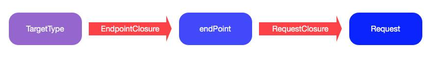

# Moya的使用

## 关于Moya
[Moya](https://github.com/Moya/Moya)是对[Alamofire](https://github.com/Alamofire/Alamofire)的再次封装。

让我们用一张图来简单来对比一下直接用Alamofire和用moya的区别：


## 有关Alamofire
为了对Moya有更好的了解。让我们先复习一下Alamofire的用法。

### Alamofire的用法
用法一:

``` Swift
let parameters: Parameters = [
	"foo": [1,2,3],
	"bar": [
	"baz": "qux"
]
Alamofire.request("https://httpbin.org/post", method: .post, parameters: parameters, encoding: JSONEncoding.default)
```

用法二：

``` Swift
Alamofire.request("https://httpbin.org/get")
.validate(statusCode: 200..<300)
.validate(contentType: ["application/json"])
.responseData { response in
	switch response.result {
	case .success:
		print("Validation Successful")
		case .failure(let error):
		print(error)
	}
}
```

Alamofire请求时输入各种请求的条件(url, parameters, header,validate etc)的时候略显累赘，如果我们要设置默认parameters，还有针对特定API做修改的时候，实现起来就会很费劲。

然后，就有了我们Moya。


## Moya的简单实用

### Moya的快速上手
Moya是通过`POP`(面向协议编程)来设计的一个网络抽象库。

moya简单使用的example:

``` Swift
public enum GitHub {
    case zen
    case userProfile(String)
    case userRepositories(String)
}

extension GitHub: TargetType {
	// 略过
}

let provider = MoyaProvider<GitHub>()
provider.request(.zen) { result in
    // `result` is either .success(response) or .failure(error)
}
```


#### 1. 创建一个Provider
provider是网络请求的提供者，你所有的网络请求都通过provider来调用。我们先创建一个provider。

provider最简单的创建方法:

``` Swift
// GitHub就是一个遵循TargetType协议的枚举(看上面例子)
let provider = MoyaProvider<GitHub>()

```

让我看看provider是什么：

``` Swift
open class MoyaProvider<Target: TargetType>: MoyaProviderType {
	//略过....
}
```

provider是一个遵循	`MoyaProviderType`协议的公开类，**他需要传入一个遵循`TargetType`协议的对象名，这是泛型的常规用法，大家可以自行Google一下**。

如果我们要创建provider，我们要看看他的构造方法:

``` Swift
/// Initializes a provider.
    public init(endpointClosure: @escaping EndpointClosure = MoyaProvider.defaultEndpointMapping,
                requestClosure: @escaping RequestClosure = MoyaProvider.defaultRequestMapping,
                stubClosure: @escaping StubClosure = MoyaProvider.neverStub,
                callbackQueue: DispatchQueue? = nil,
                manager: Manager = MoyaProvider<Target>.defaultAlamofireManager(),
                plugins: [PluginType] = [],
                trackInflights: Bool = false) {

        self.endpointClosure = endpointClosure
        self.requestClosure = requestClosure
        self.stubClosure = stubClosure
        self.manager = manager
        self.plugins = plugins
        self.trackInflights = trackInflights
        self.callbackQueue = callbackQueue
    }
    
```

provider所有的属性都是有默认值，具体怎么用我们往后再详谈。**现在主要是传入一个遵`TargetType`协议的对象**。

#### 2. 创建一个遵循TargetType协议的enum

让我们看看`TargetType`协议有什么:

``` Swift
public protocol TargetType {

    /// The target's base `URL`.
    var baseURL: URL { get }

    /// The path to be appended to `baseURL` to form the full `URL`.
    var path: String { get }

    /// The HTTP method used in the request.
    var method: Moya.Method { get }

    /// Provides stub data for use in testing.
    var sampleData: Data { get }

    /// The type of HTTP task to be performed.
    var task: Task { get }

    /// The type of validation to perform on the request. Default is `.none`.
    var validationType: ValidationType { get }

    /// The headers to be used in the request.
    var headers: [String: String]? { get }
}
```
具体的使用方法如下：

``` Swift
public enum GitHub {
    case zen
    case userProfile(String)
    case userRepositories(String)
}

extension GitHub: TargetType {
    public var baseURL: URL { return URL(string: "https://api.github.com")! }
    
    // 对应的不同API path
    public var path: String {
        switch self {
        case .zen:
            return "/zen"
        case .userProfile(let name):
            return "/users/\(name.urlEscaped)"
        case .userRepositories(let name):
            return "/users/\(name.urlEscaped)/repos"
        }
    }
    public var method: Moya.Method {
        return .get
    }
    
    // parameters，upload or download
    public var task: Task {
        switch self {
        case .userRepositories:
            return .requestParameters(parameters: ["sort": "pushed"], encoding: URLEncoding.default)
        default:
            return .requestPlain
        }
    }
    
    // 通过statuscode过滤返回内容
    public var validationType: ValidationType {
        switch self {
        case .zen:
            return .successCodes
        default:
            return .none
        }
    }
    
    // 多用于单元测试
    public var sampleData: Data {
        switch self {
        case .zen:
            return "Half measures are as bad as nothing at all.".data(using: String.Encoding.utf8)!
        case .userProfile(let name):
            return "{\"login\": \"\(name)\", \"id\": 100}".data(using: String.Encoding.utf8)!
        case .userRepositories(let name):
            return "[{\"name\": \"\(name)\"}]".data(using: String.Encoding.utf8)!
        }
    }
    public var headers: [String: String]? {
        return nil
    }
}
```
TargetType的设计理念是，先创建一个enum，如`Github`，那代表是你的服务器，case1，case2，case3代表各个API，这样就能统一处理，还可以针对个别API做不同的处理。

设置好了配置，就可以简单创建一个Provider了:

``` Swift
let provider = MoyaProvider<GitHub>()

```


### 3. 网络请求方法

创建好了Provider，我们就可以直接调用网络请求了:

``` Swift
 gitHubProvider.request(.zen) { result in
            var message = "Couldn't access API"
            if case let .success(response) = result {
                let jsonString = try? response.mapString()
                message = jsonString ?? message
            }

            self.showAlert("Zen", message: message)
        }
```
`request()` 方法返回一个`Cancellable`, 它有一个你可以取消request的公共的方法。

### 4. Result

网络请求有个回调，回调一个`Result`类型的数据:

``` Swift
Result<Moya.Response, MoyaError>
```
再看看具体定义：

``` Swift
public enum Result<Value, Error: Swift.Error>: ResultProtocol, CustomStringConvertible, CustomDebugStringConvertible {

    case success(Value)
    
    case failure(Error)
    
    //其他略过
}
```
这是一个枚举，通过枚举获取对应`value`，`error`；

这也是一个泛型的经典用法，其中 `Value` 对应 `Moya.Response`， `Error` 对应 `MoyaError`。

``` Swift
 gitHubProvider.request(.zen) { result in
            switch self {
				case let .success(response):
				   let json = try response.mapJSON()
					print("\(json)");
					
				case let .failure(error):
					break;
				}
        }

```

`Moya.Response`是`public final class`, 里面有一些好用的方法:

``` Swift
// 转换为Image
func mapImage() throws -> Image;

// 转换为Json
func mapJSON(failsOnEmptyData: Bool = true) throws -> Any;

// 装换为String
func mapString(atKeyPath keyPath: String? = nil) throws -> String;

// 转换为对应的model
func map<D: Decodable>(_ type: D.Type, atKeyPath keyPath: String? = nil, using decoder: JSONDecoder = JSONDecoder(), failsOnEmptyData: Bool = true) throws -> D;
```

有关`Moya.Response`，`MoyaError`大家可自行看看源码，有很多好用的属性及方法。


## Moya的高级用法
Moya实现了网络层的高度抽象，它是通过以下管道来实现这一点的：


让我们回顾一下，`Provider`的构造方法:

``` Swift
/// Initializes a provider.
    public init(endpointClosure: @escaping EndpointClosure = MoyaProvider.defaultEndpointMapping,
                requestClosure: @escaping RequestClosure = MoyaProvider.defaultRequestMapping,
                stubClosure: @escaping StubClosure = MoyaProvider.neverStub,
                callbackQueue: DispatchQueue? = nil,
                manager: Manager = MoyaProvider<Target>.defaultAlamofireManager(),
                plugins: [PluginType] = [],
                trackInflights: Bool = false) {

        self.endpointClosure = endpointClosure
        self.requestClosure = requestClosure
        self.stubClosure = stubClosure
        self.manager = manager
        self.plugins = plugins
        self.trackInflights = trackInflights
        self.callbackQueue = callbackQueue
    }
    
```

Provider输入的参数包括：`EndpointClosure `,`RequestClosure `,`StubClosure `, `callbackQueue `,`plugins `, `trackInflights `。

### Endpoints
> `Provider` 将 `Targets` 映射成 `Endpoints `, 然后再将 `Endpoints ` 映射成真正的 `Request`。

而`EndpointClosure = (Target) -> Endpoint`就是定义如何将 `Targets 映射为 `Endpoints `

在这个闭包中，你可以改变`task`，`method`，`url`, `headers` 或者 `sampleResponse `。比如，我们可能希望将应用程序名称设置到HTTP头字段中，从而用于服务器端分析。

``` Swift
let endpointClosure = { (target: MyTarget) -> Endpoint in
    let defaultEndpoint = MoyaProvider.defaultEndpointMapping(for: target)
    return defaultEndpoint.adding(newHTTPHeaderFields: ["APP_NAME": "MY_AWESOME_APP"])
}
let provider = MoyaProvider<GitHub>(endpointClosure: endpointClosure)
```

### requestClosure
前面`endpointClosure `会把`target`映射为`endpoint`, Moya会把`endpoint`转换为一个真正的`Request`。

`RequestClosure = (Endpoint, @escaping RequestResultClosure) -> Void` 就是 `Endpoint` 转换为 `Request`的一个拦截，它还可以修改请求的结果( 通过调用`RequestResultClosure = (Result<URLRequest, MoyaError>)` )

``` Swift
let requestClosure = { (endpoint: Endpoint, done: MoyaProvider.RequestResultClosure) in
    do {
        var request = try endpoint.urlRequest()
        // Modify the request however you like.
        done(.success(request))
    } catch {
        done(.failure(MoyaError.underlying(error)))
    }

}
let provider = MoyaProvider<GitHub>(requestClosure: requestClosure)
```

### stubClosure

下一个选择是来提供一个`stubClosure`。这个闭包返回 `.never` (默认的), `.immediate` 或者可以把stub请求延迟指定时间的`.delayed(seconds)`三个中的一个。 例如, `.delayed(0.2)` 可以把每个stub 请求延迟0.2s. 这个在单元测试中来模拟网络请求是非常有用的。

更棒的是如果您需要对请求进行区别性的stub，那么您可以使用自定义的闭包。

``` Swift
let provider = MoyaProvider<MyTarget>(stubClosure: { target: MyTarget -> Moya.StubBehavior in
    switch target {
        /* Return something different based on the target. */
    }
})
```

### manager
`Provider`里面你可以自定义一个 `Alamofire.Manager`实例对象。

``` Swift
// 这是Moya默认的manager
public final class func defaultAlamofireManager() -> Manager {
    let configuration = URLSessionConfiguration.default
    configuration.httpAdditionalHeaders = Alamofire.Manager.defaultHTTPHeaders

    let manager = Alamofire.Manager(configuration: configuration)
    manager.startRequestsImmediately = false //设定false，为了单元测试
    return manager
}
```
用法如下：

``` Swift
let userModuleProvider = MoyaProvider<UserModule>(manager:yourManager)
```

### plugins(插件)
最后, 您可能也提供一个`plugins`数组给`provider`。 这些插件会在请求被发送前及响应收到后被执行。 `Moya`已经提供了一些插件: 一个是 网络活动(`NetworkActivityPlugin`),一个是记录所有的 网络活动 (`NetworkLoggerPlugin`), 还有一个是 HTTP Authentication。

`plugins`里面的对象都遵循协议`PluginType`, 协议了规定了几种方法，阐述了什么时候会被调用。

``` Swift
public protocol PluginType {
    /// modified Request 请求发送之前调用(主要用于修改request)
    /// Called to modify a request before sending.
    func prepare(_ request: URLRequest, target: TargetType) -> URLRequest

    /// Request 请求发送之前调用
    /// Called immediately before a request is sent over the network (or stubbed).
    func willSend(_ request: RequestType, target: TargetType)

    /// 接收到了response，completion handler 之前调用
    /// Called after a response has been received, but before the MoyaProvider has invoked its completion handler.
    func didReceive(_ result: Result<Moya.Response, MoyaError>, target: TargetType)

    /// completion handler 之前调用(主要用于修改result)
    /// Called to modify a result before completion.
    func process(_ result: Result<Moya.Response, MoyaError>, target: TargetType) -> Result<Moya.Response, MoyaError>
}
```

Moya已经有了一个`NetworkActivityPlugin `:

``` Swift
public final class NetworkActivityPlugin: PluginType {

    public typealias NetworkActivityClosure = (_ change: NetworkActivityChangeType, _ target: TargetType) -> Void
    let networkActivityClosure: NetworkActivityClosure

    public init(networkActivityClosure: @escaping NetworkActivityClosure) {
        self.networkActivityClosure = networkActivityClosure
    }

    public func willSend(_ request: RequestType, target: TargetType) {
        networkActivityClosure(.began, target)
    }

    public func didReceive(_ result: Result<Moya.Response, MoyaError>, target: TargetType) {
        networkActivityClosure(.ended, target)
    }
}
```

它的用法也好简单：

``` Swift
static var plugins: [PluginType] {
        let activityPlugin = NewNetworkActivityPlugin { (state, targetType) in
            switch state {
            case .began:
                if targetType.isShowLoading { //这是我扩展的协议
                    // 显示loading
                }
            case .ended:
                if targetType.isShowLoading { //这是我扩展的协议
                    // 关闭loading
                }
            }
        }
        
        return [
            activityPlugin, myLoggorPlugin
        ]
    }
    
 let userModuleProvider = MoyaProvider<UserModule>(plugins: plugins)
    
```
